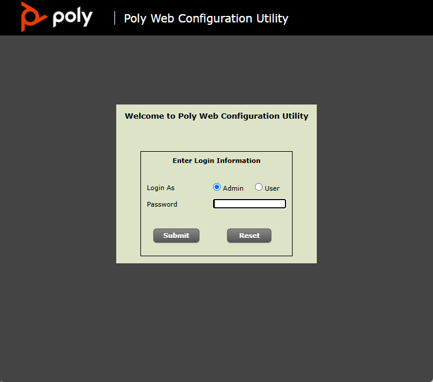
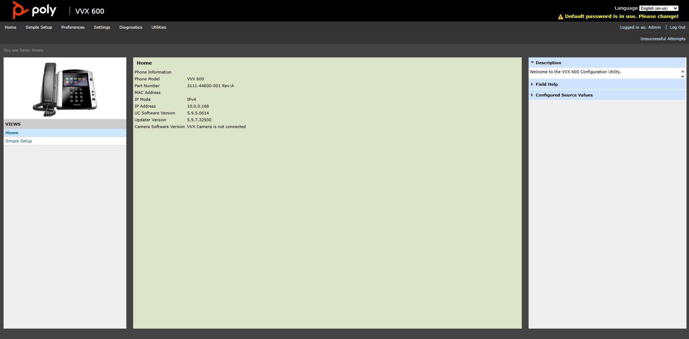
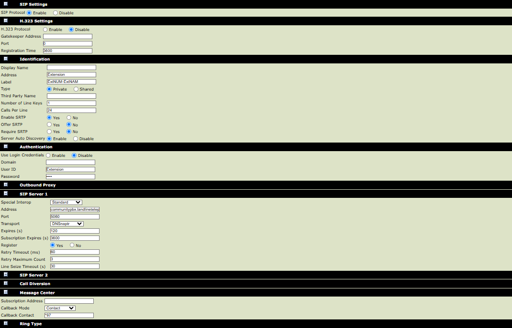

# Poly/Polycom VVX/SoundPoint series

Manually configuring a Polycom/Poly VVX/SoundPoint phone can be somewhat complex compared to most SIP phones. Enabling auto-answer for pages requries manually editing the phones config file. For this reason, provisioning is recommended for new users. 

We recommend configuring the phone via the web interface. It can be done on the phone itself, but is rather hard.

## Setup extension via Poly Web Configuration Utility (web interface)

Find the IP address of the phone, then go to https://<ip> in your browser (The phone will not allow HTTP (port 80) by default!).

{ width="250" height="250" style="display: block; margin: 0 auto" }

Login as admin. The default password is 456 if you are running an older frimware. (Newer frimware requries admin password to be set upon first boot.)

Once logged in you should be at the homepage:

{ width="250" height="250" style="display: block; margin: 0 auto" }

Some models of VVX 500/600 phones may default to Skype for Business mode. If you are using a VVX 500/600 phone, go to Simple Setup, Base Profile, and make sure its set to Generic. 

On the top, go to settings, and click lines.

Now select the line to use (Lines **CANNOT** have gaps and must bein order. So for example if you setup Line 2 but not Line 1, Line 2 will not show up, or if you setup Line 1, 2, and 4 but not 3, Line 4 will not show up)

Under the line settings, set the following:

### SIP Settings
*Only applicable to certain models*

SIP Protocol: Enable

### H.323 Settings
*Only applicable to certain models*

H.323 Protocol: Disable

### Identification
Address: Your extension number

Label: Whatever you want, this will show up on the line key. (Recommended: <YourExtensionNumber>-<YourExtensionName>

### Authentication
Use Login Credentials: Disable

User ID: Your extension number

Password: Your SIP Password

### SIP Server 1
Address: communitypbx.landlinetelephonesociety.com

Port: 5060 (You can also use 17777 as alternative port if you cannot use 5060 for some reason) 

Transport: This is fine as the default value of DNSSanptr, however if you are having issues with the line staying registered, change this to TCPpreferred.

### Message Center
*THIS IS REQURIED FOR THE VOICEMAIL BUTTON TO WORK PROPERLY, BUT IS OPTIONAL*

Callback Mode: Contact

Callback Contact: *97

Once you did all that, the config should look something like this:

{ width="250" height="250" style="display: block; margin: 0 auto" }

Now save the config. The phone screen should reload, and the line key should show. A green check indicates the line is registered and good to go. If not, make sure you entered the correct info, and refer to Troubleshooting: Line not registered.

While unlikey, if you are unable to receive incoming calls after a few mintues of making a call, go to Settings > Networking > NAT and set Keep-Alive Interval (s) to 15. This may be an issue on some older or cheaper routers.

## Uploading custom Backgrounds and Ringtones

Unlike alot of other phones, Polycoms do not support storing Backgrounds and Ringtones on device. You will either need to use Poly Lens, or an HTTP, FTP, or TFTP server to store wallpapers and ringtones. Refer to setting up a HTTP server, setting up a TFTP server, or using Poly Lens. Once setup, store the wallpapers or ringtones on the server. Then go to Ringtones or Backgrounds, click add, select "Enter URL / file name stored in boot server", and enter the file URL, or if you set the server as the devices provsioing server, and enter the file name directly. Audio files must be a .wav and must be encoded in G.711u-law, G.711a-law, G.722, G.729AB, Lin16, or iLBC. Backgrounds must be JPEG, BMP, or PNG.

