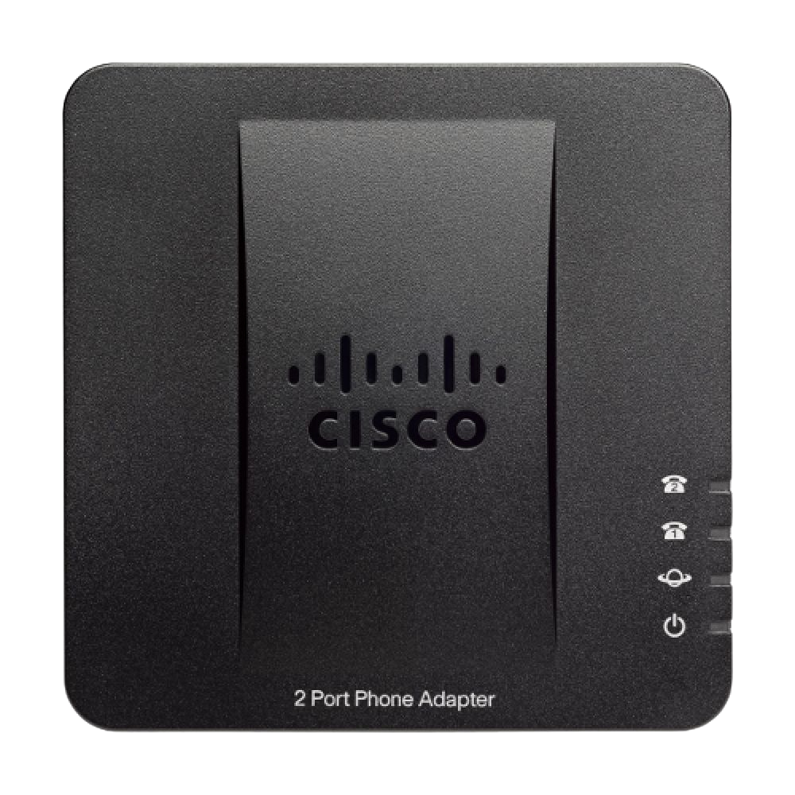
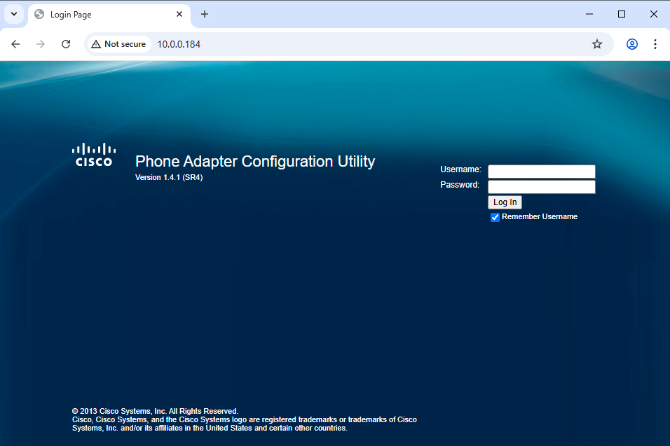

# Cisco SPA 112/122/232D
Linksys SPA ATAs are provisioned slightly differently, see Provisioning a Linksys SPA ATA

{ width="250" height="250" style="display: block; margin: 0 auto" }

To get started, provide your ATA's MAC address to administration. The MAC address is located on the bottom of the unit.

Then, plug in your ATA with a 5V 2A power supply. Then connect the ATA to your network through the blue ethernet port. Wait 3-5 mins for the ATA to boot.

You may need to factory reset the ATA. If one or both of the line lights light up, factory reset the ATA by inserting something like a SIM card ejector, small screwdriver, or other small pointy object into the reset button on the back of the ATA next to the DC jack for 60 seconds.

You also may need to do this if the default password does not work.

Once the ATA is fully booted, obtain the device's local IP. You can do this using your router's web interface, or as shown below, plug a phone into the ATA, then dial * * * *, then 1 1 0, #.

You will not hear a dial tone like in this example if the ATA has been factory reset properly. This is normal.

So for our example, the IP of the ATA is "10.0.0.184".

If you get "0.0.0.0" or an IP that starts with "169.254", either the ATA is not on a network, or DHCP has failed and you need to manaully give the ATA an IP.

See Use IVR for Administration on the SPA100 Series for how to set a static IP on the ATA.

But for most people, the ATA should be automatically assigned an IP via DHCP.

This IP address is only a local IP on your network. It is not a public IP and is not the same as your public IP. It can only be reached on your local network.

The next step will differ depending on if your on a SPA112 or SPA122

If you are using a SPA112:

Open a browser on a device on the same network as the ATA and open http://deviceip

If you are using a SPA122:

Plug a computer or other device with a ethernet port and a browser into the yellow ethernet port, make sure that device is not on any other network including wifi, and in your browswer, open http://192.168.15.1

The reason you need to do this is because the SPA122 also acts like a router.

Login with the default username and password of "admin", "admin".

Once logged in, you will see the interface as shown below

![Cisco SPA112 Quick Setup Page]ataquicksetup.png)

If you are using a SPA122, you will most likey want to make it so you can access the web interface from any device on your main lan.

To do this, go to Administration on the top, user list on the left, click the pencil next to admin, and set a new password, then go back to the Administration tab, and under Web Access Management, enable "Remote Management", and submit.

You will now be able to access the ATAs web interface like you can on the SPA112 by going to the devices IP in your web browser.

Now on the top, go to voice. And make sure "Customization" is displayed as "Open". If it's not, your ATA is locked to another service provider and you will need to contact them to get it unlocked.

Cisco SPA112 Voice Setup Page

Then on the left, click Provisioning, then change the following settings:

Provision enable: Yes

Profile rule: http://communitypbx.landlinetelephonesociety.com:84/spa$MA.xml

Transport Protocol: http

It should look like this:

Cisco SPA112 Provisioning Setup Page

Then click submit, and wait for the ATA to reboot.

Then now go to Administration on the top, click reboot on the right, and click reboot.

Give the ATA around 3-5 mins to fully boot. You will know when it's done when both line LEDs are solid. Now plug a phone into the ATA, you should get a dial tone, and you should now be ready to make and receive calls.

If this does not work, contact administration for support.