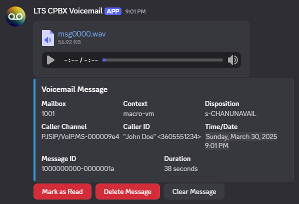

# Voicemail

The voicemail feature allows you to receive messages to a secure mailbox and then retrieve them later either via phone, Discord, or email.

The voicemail feature is enabled for all extensions. But can be disabled at the request of the user.

## How it works

When someone calls you and you don't answer, don't have any phones online, are on DND, you reject the call, or you are on the phone and don't have call waiting enabled, the user will be sent to voicemail. If you don't have a recorded name, they will hear "The person at extension, _, is unavailable." if you don't have any phones online, or reject or don't answer the call. They will be prompted the leave a message.

## Greetings

By default, when someone gets to your voicemail, they will hear "The person at extension, __, is unavailable." if your offline or do not answer. Or "The person at extension, _, is on the phone." if you are on DND or on the phone. When you record your name, your name recording will override "The person at extension". You can also record custom greetings for both unavailable and busy (on the phone). You can also record a tempoary greeting. A tempoary greeting lets you temporarily override your other greetings if your on vacation for example without overwriting your normal greetings. Once the greeting plays, the caller will hear "Please leave your message after the tone. When done hang up, or press the pound key.". There is no way to turn this greeting off. It's there to ensure the caller gets the correct info and that they know they are leaving a voicemail regradless of the greeting.

## Phone Menu

You can get to voicemail via your extension by dialing \*97. If you have a provisoined phone that has a voicemail key, pressing it will take you to the voicemail menu as well. If this is your first time using the voicemail menu, you will be prompted to record your name and setting your user password. This password is used across alot of LTS Community PBX services and it's important you remember it and not share it. The password cannot be less then 4 digits long, cannot use sequential (e.g, 1234, 5678, 3456) or repeated (e.g, 1111, 2222, 3333) digits, and cannot be the same as your extension number.

You can also access the voicemail menu via phone using the PSTN user menu, allowing you to check your voicemail from any touch-tone telephone in the world. When you dial in to the system, press 8, enter your extension, and your user password, and then on the menu press 1 to get to your voicemail. This feature will only work if you set your voicemail password.

At the voicemail menu, if you have new messages, you will hear "You have, _ new, messages." And pressing 1 will let you listen to your new messages. If not, it will tell you how many old messages you have. You can press 2 to switch folders. If you have new messages but want to listen to your old messages, or saved your messages in a folder such as "Work", "Family", Or "Friends", you can get to them here. You can press 3 for advanced options. Here you can leave someone else on the system a message. Pressing 0 takes you to your mailbox options. This lets you record your greetings, name recording, and change your user password. You can press \* any instructions again, or # to exit the voicemail menu.

When you listen to a message, you will hear the date/time stamp and the phone number or extension of who left it. When your done listening to a message, you can press 3 then 1 to reply to the message if it came from an internal extension, 3 then 3 to hear date/time stamp and phone number again, 5 to repeat the message, 6 to play the next message, 7 to delete it, 8 to foward the message to another extension, or 9 to move it to a folder such as "Work", "Family", "Friends", or back to new messages. 

## Discord

If your extension is linked to a Discord account and you are in the LTS server, you can get all your voicemails sent to your DMs.

{style="display: block; margin: 0 auto" }

An attachment of the recording will be included. If the file is larger then 25 MB, a link to download the voicemail file will be included instead.

The message in Discord will also include the mailbox/extension it was left at, the disposition of the call (reason the call went to voicemail), when it was left, duration, message ID, and the caller ID of who left it.

You can click mark as read and the message will be sent to old messages and if it's the only remaining unread message, will clear the MWI on your phone(s). Clicking delete message will completely remove it from your mailbox but won't delete it from Discord. Clicking clear message will clear it from Discord. **Clicking clear message will not delete the message from your mailbox.**

## User Control Panel

You can view voicemails for all extensions you own via the voicemail app in the UCP.

{style="display: block; margin: 0 auto" }

A list of all voicemails on all your extensions sorted by newest first will be presented categorized by URGENT, New, and Old messages. You can also delete messages, mark unread messages as read, and move them to diffrent folders. Playing an unread message marks it as read automatically.  

## Email

You can get your voicemail sent to your email if requested. When you get a new voicemail, a message will be sent containing the message details, and an attachment of the message. There is no way to mark the message as read, or delete it from email.

## SMS

You can enable SMS notifications for voicemail. At this time, The message will only say the details of the message. The recording will not be attached.

## Message Waiting Indicator (MWI)

On supported phones, a light or notification will pop up or appear to notify you of a message. Some may tell you the amount of messages waiting as well. Most ATAs will do this too. They can send an FSK signal which will show a MWI Indicator on connected landline phones, and provide a stuttered dial tone. 

## Answering Machines/Systems

When using an answering machine or answering system, any unanswered calls may be picked up by it rather then going to the voicemail system. This means that you won't be able to use any of the features from the voicemail service such as voicemail to discord and voicemail to email. You may still be able to listen to messages remotely by using your machines remote access feature if it has it, or listening to call recordings if you have those enabled.

## Limits and restrictions

Each mailbox is limited to 9999 messages. Once that limit is reached, nobody will be able to leave you messages. 

Your voicemail recordings cannot contain content that is racist, offensive, or otherwise breaks the systems terms of service.

Your voicemail name recording **CANNOT BE BLANK**, and **CANNOT BE ANYTHING BUT YOUR NAME**. 

Using the voicemail service to otherwise break the terms of service is prohibited.

Repeated breaking of the ladder 3 restrictions can result in termination of voicemail service discretion of administration.

